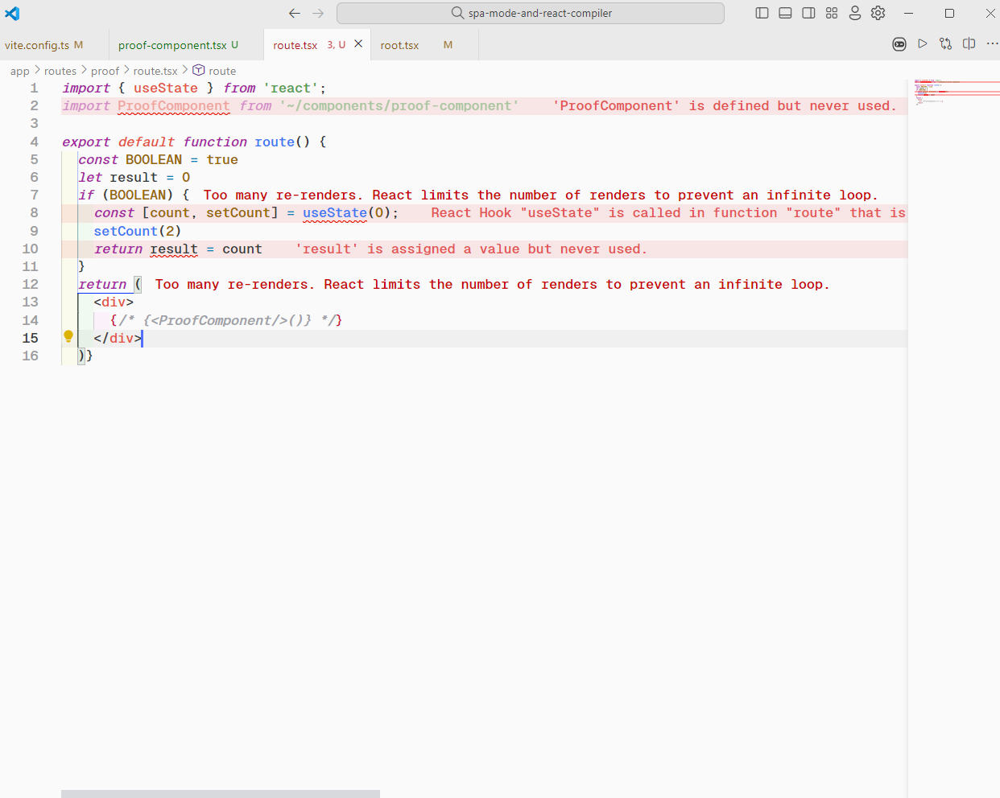
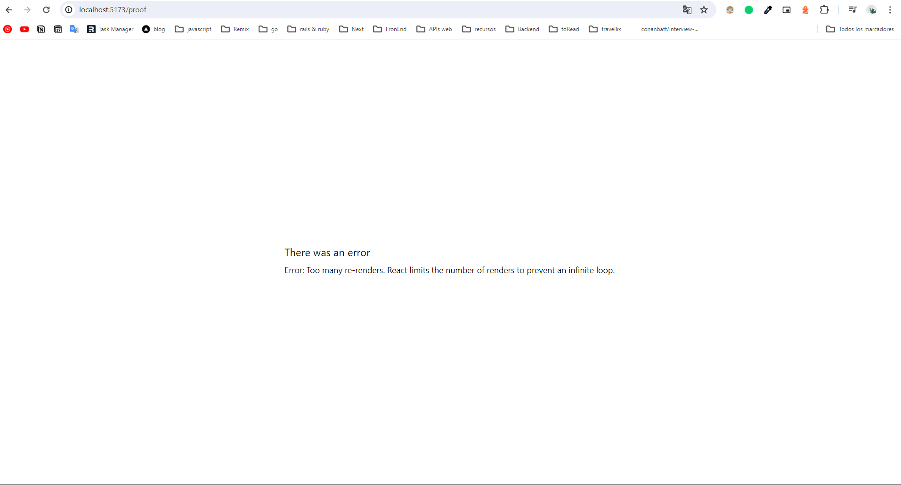
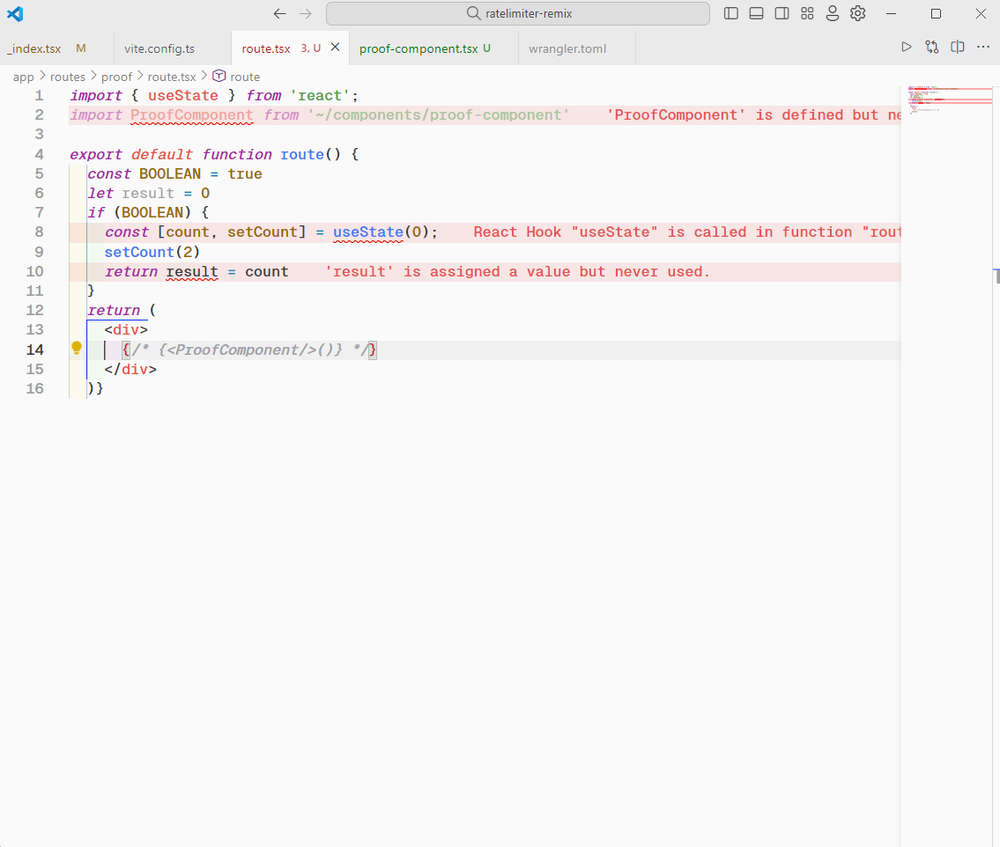
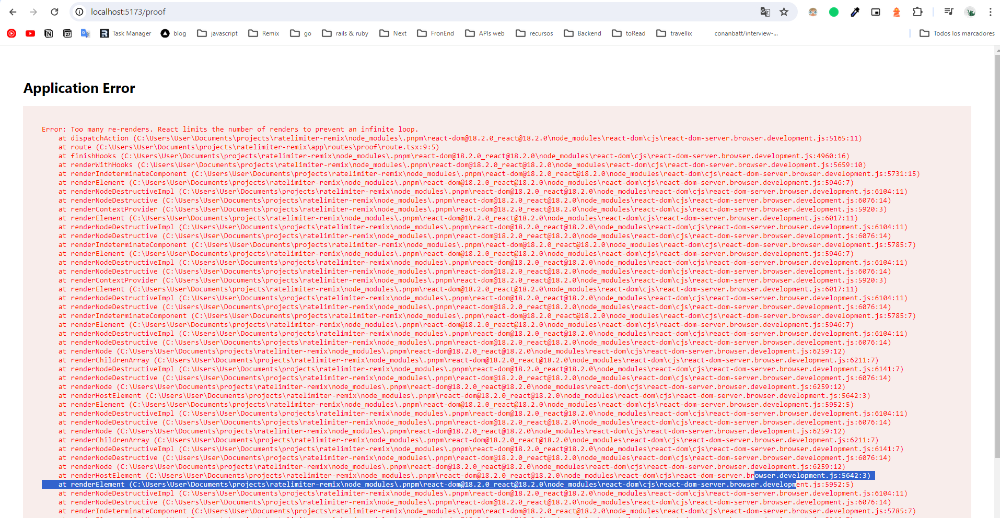

# Testing React compiler wiht remix remix-cloudflare-template

I use de template with remix + vite for cloudflare [remix-cloudflare-template](https://github.com/edmundhung/remix-cloudflare-template) and follow de guide [React Compiler](https://react.dev/learn/react-compiler)

```
npx create-remix@latest --template edmundhung/remix-cloudflare-template
```

## The test:

#### with React Compiler:





#### Without React Compiler:




